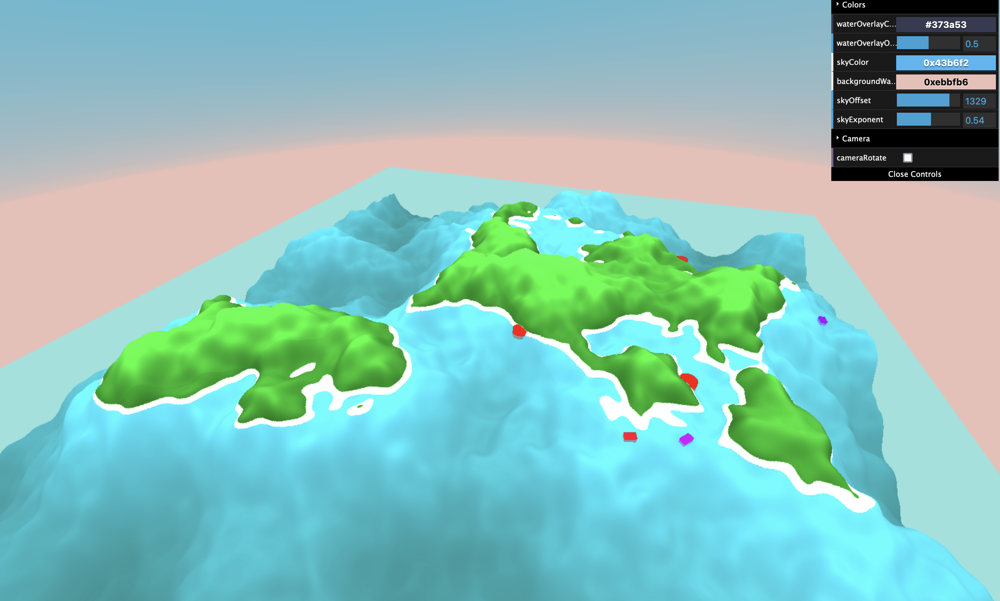

# Zen Islands

A small simulation of boats travelling between ports on procedurally generated islands. Made with THREE.js. Inspiration came from this [reddit post](https://old.reddit.com/r/dataisbeautiful/comments/pti39a/7_days_of_ship_traffic_in_the_hawaiian_islands_oc/).

I started this project to simultaneously learn 3D rendering basics and also to play around with ChatGPT and Github Copilot for helping me code. I've had various degrees of success (in terms of accurate/usable code) using the AI tools to help me make this project, but overall I'd definitely say it's noticably increased my productivity.

## TODO

- [ ] improve islandizer so edges are always water
  - Custom curve? start shallow (so can have lots of mountainous in middle), get steep at end?
- [x] make water 3d - don't set to 0, maybe translucent overlay?
- [c] switch to typescript
- [c] change colour palette
- [x] make noise less chaotic - less octaves?
- [ ] use perlin noise to add subtle biomes
- [x] change boats to triangles
- [ ] run each ship in it's own thread, or do pathfinding in seperate thread?
- [ ] fix x/y getting screwed up - only notice when map is not square
- [ ] Make background look prettier, figure out a way to blend the mesh so it doesn't look like it's a floating rectangle
- [ ] host demo on website

## Stretch Goals

- [ ] add interactive buttons to regenerate (and do on timer), stop movement, create ships etc
- [ ] Add seed to noise generator
- [ ] add random names to large land-masses
- [ ] add fishing vessels that navigate to random points before returning to port
- [ ] slow day-night cycle with shadows

## Resources

- https://cmaher.github.io/posts/working-with-simplex-noise/
- https://en.wikipedia.org/wiki/Fractional_Brownian_motion
- https://medium.com/@travall/procedural-2d-island-generation-noise-functions-13976bddeaf9
- https://shanee.io/blog/2015/09/25/procedural-island-generation/
- https://natureofcode.com/book/chapter-6-autonomous-agents/
- https://chat.openai.com/

## Running

`npx vite`

Manual terrain testing

`node -r esm heightmap.js`

